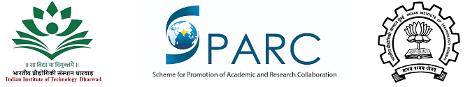

### About
This one-week course will focus on methods for discrete-time modeling and sound synthesis of musical acoustic systems, as well as common techniques for measuring the characteristics of musical instruments. The course will be oriented toward students with an existing background in digital signal processing (DSP). The initial emphasis will be on signal processing methods for efficient synthesis of simple string and wind instruments. Topics covered will include the use of delay lines to simulate wave propagation and digital waveguide techniques to properly account for associated discontinuities or boundary conditions. Measurement techniques to be covered will include approaches to determine admittances or impedances of string and wind instrument bodies, as well as experimental modal analysis and other imaging techniques to visualize the vibrations of systems.

### When?
December 9-13, 2019

### Where?
IIT Dharwad

## Tentative Course Schedule
(Detailed schedule will be published by Nov 20)

### 09 Dec 2019: Public Seminar
* Invited Talks by Prof. Gary Scavone, Prof. Xavier Serra, Prof. Preeti Rao, Prof. Hema Murthy and G Raj Narayan (Radel) on general topics in Music Technology and Music Instrument modeling
* Panel Discussion
* Musical Concert

### 10-13 Dec 2019: Course on Modeling of Music Instruments Course Content:
* Acoustic Modeling and Acoustic Wave Simulation
* String Instruments: Digital waveguide modeling, Karplus-Strong
* String Instruments: Commuted synthesis, piano hammer
* Wind Instruments: Pipe impulse response
* Measurements: Vibrational/acoustic measurement techniques

### Speakers:
* Prof. Gary Scavone, Schulich School of Music, McGill University, Canada
* Prof. Xavier Serra, Music Technology Group, Universitat Pompeu Fabra, Barcelona, Spain
* Prof. Preeti Rao, Dept. of Electrical Engineering, IIT Bombay, India
* Prof. Hema A Murthy, Dept. of Computer Science and Engineering, IIT Madras, India
* Prof. S R Mahadeva Prasanna, Dept. of Electrical Engineering, IIT Dharwad, India
* G Raj Narayan, Chief Innovator and Managing Director, Radel 

### Course Coordinators:
* Prof. Dhiraj V. Patil, Dept. of Mechanical Engineering, IIT Dharwad, India
* Dr. Ajay Srinivasamurthy, Applied Scientist, Amazon.com, Bengaluru, India

### Organized by

 

    
