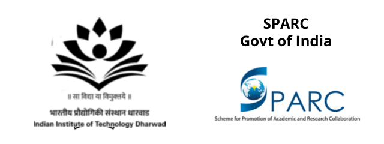

### About
This one-week course will focus on methods for discrete-time modeling and sound synthesis of musical acoustic systems, as well as common techniques for measuring the characteristics of musical instruments. The course will be oriented toward students with an existing background in digital signal processing (DSP). The initial emphasis will be on signal processing methods for efficient synthesis of simple string and wind instruments. Topics covered will include the use of delay lines to simulate wave propagation and digital waveguide techniques to properly account for associated discontinuities or boundary conditions. Measurement techniques to be covered will include approaches to determine admittances or impedances of string and wind instrument bodies, as well as experimental modal analysis and other imaging techniques to visualize the vibrations of systems.

### When?
December 9-13, 2019

### Where?
IIT Dharwad

### Course Content:
* Day 1: Acoustic Modeling and Acoustic Wave Simulation
* Day 2: String Instruments: Digital waveguide modeling, Karplus-Strong
* Day 3: String Instruments: Commuted synthesis, piano hammer
* Day 4: Wind Instruments: Pipe impulse response
* Day 5: Measurements: Vibrational/acoustic measurement techniques

### Resource Persons:
* Prof. Gary Scavone, Schulich School of Music, McGill University, Canada
* Prof. Xavier Serra, Music Technology Group, Universitat Pompeu Fabra, Barcelona, Spain
* Prof. SRM Prasanna, Dept. of Electrical Engineering, IIT Dharwad, India
* Prof. Hema A Murthy, Dept. of Computer Science and Engineering, IIT Madras, India
### Course Coordinators:
* Prof. Dhiraj V. Patil, Dept. of Mechanical Engineering, IIT Dharwad, India
* Dr. Ajay Srinivasamurthy, Applied Scientist at Amazon.com, Bangalore, India

### Registrations:
* Expected Participants: 3rd/4th year undergraduates in Engg. and Music Technology,
* ME/MTech/MS, Research scholars, Industrial persons.

Participants are desired to have a strong background (3+ years of undergraduate
curriculum) in two or more of the following: signal processing, programming, artificial
intelligence/machine learning, music. Research scholars and musicians with an interest in
technology are welcome.

Please fill out the pre-registration form, if interested. (Limited seats). We will get back to you
with further instructions by October 10, 2019.  

### Organized by

 

    
