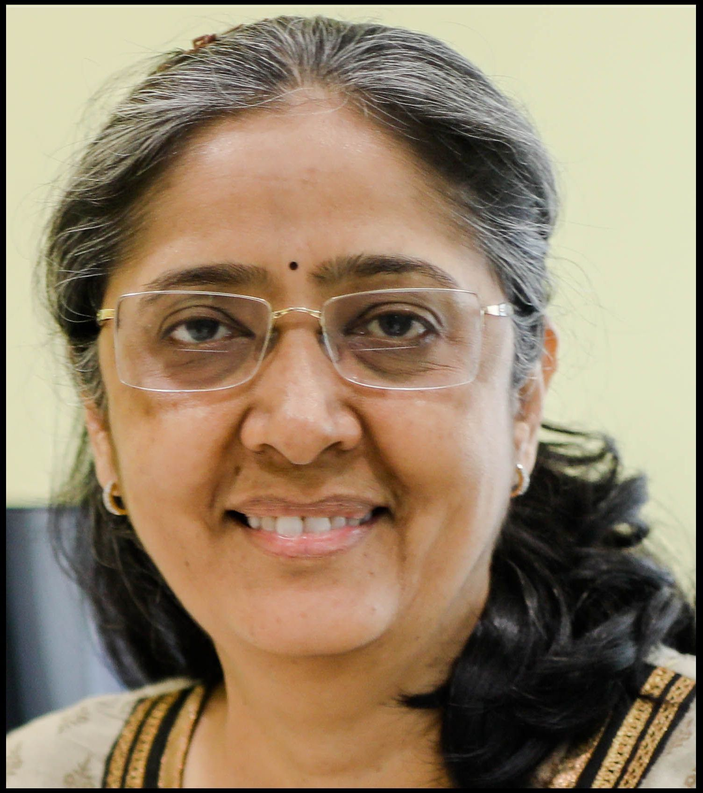
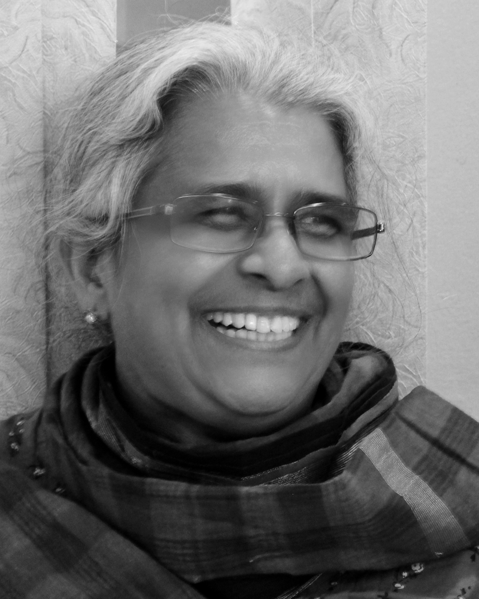
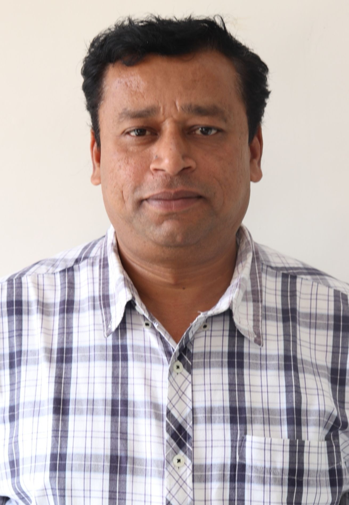

  
    

* <a href="http://www.music.mcgill.ca/~gary/">Prof. Gary Scavone</a>  
Schulich School of Music, McGill University, Canada
     
   
 
   
    

* <a href="https://www.ee.iitb.ac.in/web/people/faculty/home/prao">Prof. Preeti Rao</a>  
Department of Electrical Engineering, IIT Bombay, India
       
    
  

    
 
* <a href="https://www.upf.edu/web/xavier-serra">Prof Xavier Serra</a>  
Music Technology Group, UPF Barcelona  
  
  

    
 
* <a href="https://www.cse.iitm.ac.in/profile.php?arg=Mjk=">Prof Hema Murthy</a>  
Dept. of Computer Science and Engineering, IIT Madras, India
  
  

    
 
* <a href="https://www.iitdh.ac.in/prasanna/">Prof S R Mahadeva Prasanna</a>  
Dept. of Electrical Engineering, IIT Dharwad, India 
  
  

    
 
* <a href="http://grajnarayan.com/about-grajnarayan/">G Raj Narayan</a>  
Founder, Chief Innovator and Managing Director at Radel
  
  
